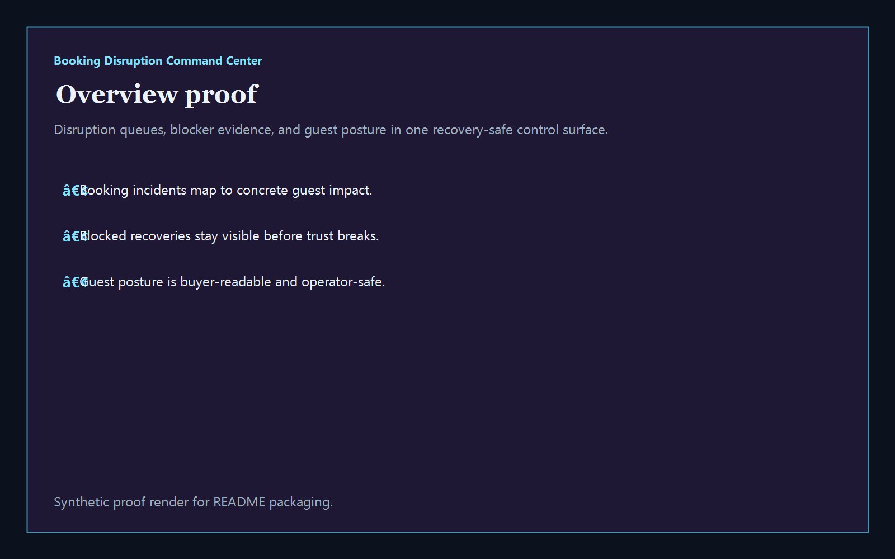
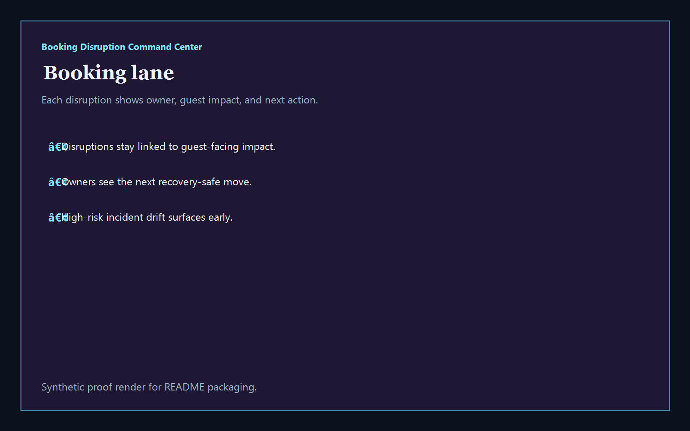
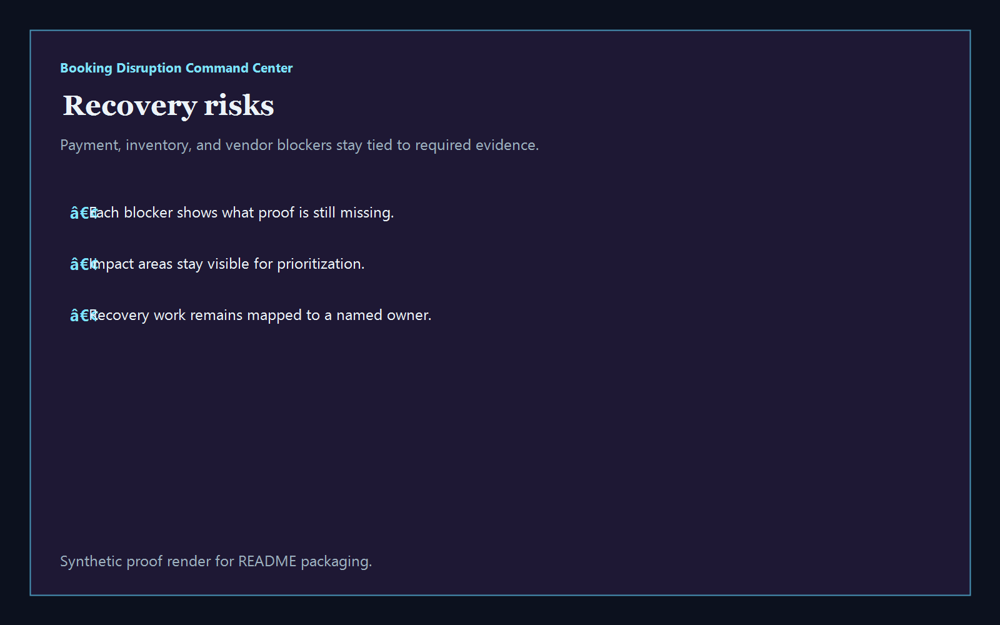
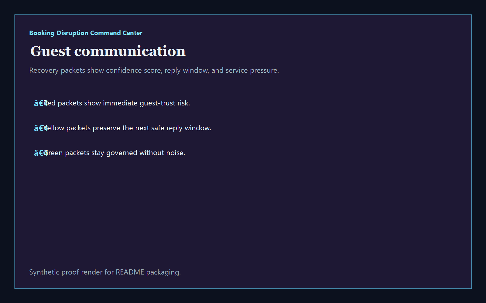

# Booking Disruption Command Center

[](https://github.com/mizcausevic-dev/booking-disruption-command-center/actions/workflows/ci.yml)
[](./LICENSE)
[](./.github/dependabot.yml)
[](https://github.com/mizcausevic-dev/booking-disruption-command-center/actions/workflows/pages.yml)


TypeScript command center for booking disruptions, recovery blockers, guest communication posture, and hospitality-grade service restoration operations.

## Why this exists

- Hospitality and travel teams lose guest trust when payments, inventory, and messaging break in different systems at different speeds.
- Booking recovery needs a clear view of which incidents are live, which blockers still need proof, and which guest packets should not go out yet.
- Hospitality / Travel Tech buyers care whether service recovery can stay safe without fragmenting guest messaging, vendor escalations, or revenue operations.
- Operators want tooling that turns disruption chaos into governed recovery lanes, named ownership, and measurable guest-trust posture.

## Why this matters (KG Embedded tie-back)

This repo demonstrates the disruption-recovery primitive for Hospitality / Travel Tech buyers: incidents, blockers, and guest-facing posture tied into one operator surface. A B2B SaaS buyer would care because guest, booking, and recovery data often need to surface inside customer-facing products without exposing unsafe write paths or fragmented operational evidence. Kinetic Gain Embedded extends this into security-first in-product analytics for booking recovery, service delivery, and guest-trust workflows, see [kineticgain.com/embedded](https://kineticgain.com/embedded).

## Routes

- `/`
- `/booking-lane`
- `/recovery-risks`
- `/guest-communication`
- `/verification`
- `/docs`

## API

- `/api/dashboard/summary`
- `/api/booking-lane`
- `/api/recovery-risks`
- `/api/guest-communication`
- `/api/verification`
- `/api/sample`

## Screenshots






## Local Development

```powershell
cd booking-disruption-command-center
npm install
npm run dev
```

Open:
- [http://127.0.0.1:5540/](http://127.0.0.1:5540/)
- [http://127.0.0.1:5540/booking-lane](http://127.0.0.1:5540/booking-lane)
- [http://127.0.0.1:5540/recovery-risks](http://127.0.0.1:5540/recovery-risks)
- [http://127.0.0.1:5540/guest-communication](http://127.0.0.1:5540/guest-communication)
- [http://127.0.0.1:5540/verification](http://127.0.0.1:5540/verification)

## Validation

- `npm run build`
- `npm run test`
- `npm run coverage`
- `npm run demo`
- `npm run smoke`
- `npm run prerender`
- `npm run render:assets`

## Production status

<!-- Maintained by Claude Code (Platform/SRE lane) after v1.0-prod hardening. -->

| Aspect | Status |
|--------|--------|
| CI | Node 20 + 22 matrix — lint · typecheck · coverage · build · demo · smoke · `npm audit` ([workflow](./.github/workflows/ci.yml)) |
| Test coverage | 100% statements on `src/services/` (gate: ≥ 60%) |
| License | [AGPL-3.0-or-later](./LICENSE) |
| Dependencies | Dependabot weekly (npm + GitHub Actions); `npm audit --audit-level=high` in CI |
| Security | [SECURITY.md](./SECURITY.md) — 0 known high/critical advisories at v1.0-prod |
| Deploy | Static prerender → **https://bookings.kineticgain.com/** (GitHub Pages, [pages workflow](./.github/workflows/pages.yml)) |

## Docs

- [Architecture](./docs/architecture.md)
- [Origin](./docs/ORIGIN.md)
- [Kinetic Gain Embedded tie-back](./docs/KINETIC_GAIN_EMBEDDED.md)
- [Changelog](./CHANGELOG.md)
